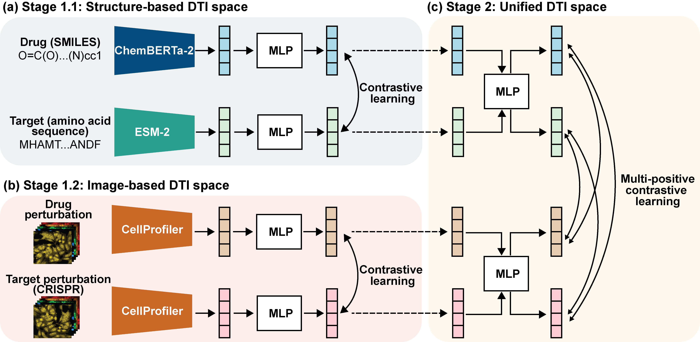

# Unified-DTI: Multimodal Contrastive Learning for Drug-Target Interaction Prediction

**Ying-Ju Lai, Tianyuzhou Liang, Po-Yuan Chen, Yu-Che Tsai, George C. Tseng, Yufei Huang, Yu-Chiao Chiu**

*Bioinformatics*, 2026 — Proceedings of ECCB2026

---

## Overview

Accurate prediction of drug-target interactions (DTIs) is fundamental to drug discovery and mechanistic understanding. Existing approaches primarily rely on molecular structures and protein sequences, while often overlooking cellular phenotypes that capture downstream biological effects.

Unified-DTI introduces a **two-stage multimodal contrastive learning framework** that integrates:

- drug molecular structures
- protein sequences
- Cell Painting morphological profiles

into a shared embedding space for DTI prediction.

### Stage 1 — Modality-Specific Contrastive Learning

Two independent contrastive models are trained:

- **Structure branch**
  - Aligns drug SMILES embeddings from **ChemBERTa-2**
  - With protein sequence embeddings from **ESM-2**

- **Image branch**
  - Aligns compound Cell Painting profiles
  - With CRISPR knockdown Cell Painting profiles

Both branches project modality-specific representations into shared 512-dimensional embedding spaces using InfoNCE loss.

### Stage 2 — Unified Multimodal Alignment

The second stage bridges the structure and image embedding spaces through multi-positive contrastive learning, producing a unified representation that jointly captures:

- molecular binding relationships
- downstream cellular phenotypes

---

## Model Workflow




---

## Architecture Overview

The project is organized into three independent training stages:

| Stage | Purpose |
|---|---|
| `stage1.1_structure` | Learns structure-based molecular representations |
| `stage1.2_image` | Learns morphology-based cellular representations |
| `stage2` | Aligns structure and image embeddings into a unified DTI space |

Each stage is self-contained and independently trainable.

### Common File Structure

| File | Description |
|---|---|
| `model.py` | Contrastive learning model architecture |
| `dataset.py` | Dataset loading and preprocessing |
| `loss.py` | Contrastive learning objectives |
| `config.py` | Hyperparameters and experiment settings |
| `train.py` | Training entry point |
| `best_model.pt` | Best-performing model checkpoint |

---

## Data

Training uses DTI pairs curated from the [MOTIVE dataset](https://github.com/carpenter-singh-lab/2024_Arevalo_NeurIPS_MotiVE), retaining only direct binding interactions.

Cell Painting profiles for compounds and CRISPR knockouts are obtained from the [JUMP Cell Painting Gallery (cpg0016)](https://github.com/jump-cellpainting/datasets).

### External Embedding Files

Large embedding files (`.pt`) are hosted on OneDrive due to file size limitations:

> **Download:**  
> https://pitt-my.sharepoint.com/:f:/r/personal/yil346_pitt_edu/Documents/Unified-DTI?csf=1&web=1&e=05Apty

After downloading, place the files into the corresponding `embedding/` directories.

---

## Installation

```bash
git clone https://github.com/YJRubyLai/Unified-DTI.git
cd Unified-DTI

pip install -r requirements.txt
```

---

## Training Pipeline

### Stage 1.1 — Structure-Based Contrastive Learning

Trains on:

- ChemBERTa-2 SMILES embeddings (384-dim)
- ESM-2 protein embeddings (1280-dim)

Both modalities are projected into a shared 512-dimensional embedding space using InfoNCE loss.

```bash
cd stage1.1_structure/model
python train.py
```

---

### Stage 1.2 — Image-Based Contrastive Learning

Trains on:

- Compound Cell Painting profiles (737-dim)
- CRISPR knockdown profiles (599-dim)

Both modalities are projected into a shared 512-dimensional embedding space using InfoNCE loss.

```bash
cd stage1.2_image/model
python train.py
```

---

### Stage 2 — Unified Multimodal Alignment

First generate projected embeddings from the trained Stage 1 models:

```bash
python stage2/embedding/generate_embeddings.py
```

Then train the Stage 2 alignment model:

```bash
cd stage2/model
python train.py
```

Stage 2 uses multi-positive InfoNCE loss, where drug-target pairs sharing the same interaction identity are treated as positives.

---

## Citation

```bibtex
@article{lai2026unified,
  title   = {Multimodal contrastive learning for integrating molecular representations and cellular phenotypes in drug-target interaction prediction},
  author  = {Lai, Ying-Ju and Liang, Tianyuzhou and Chen, Po-Yuan and Tsai, Yu-Che and Tseng, George C. and Huang, Yufei and Chiu, Yu-Chiao},
  journal = {Bioinformatics},
  year    = {2026},
  doi     = {10.1093/bioinformatics/xxxxx}
}
```